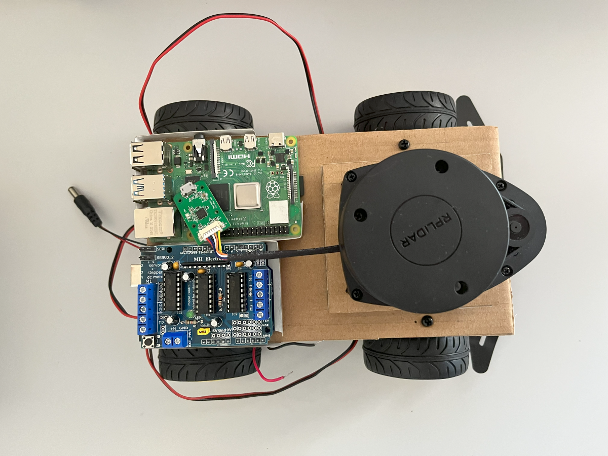
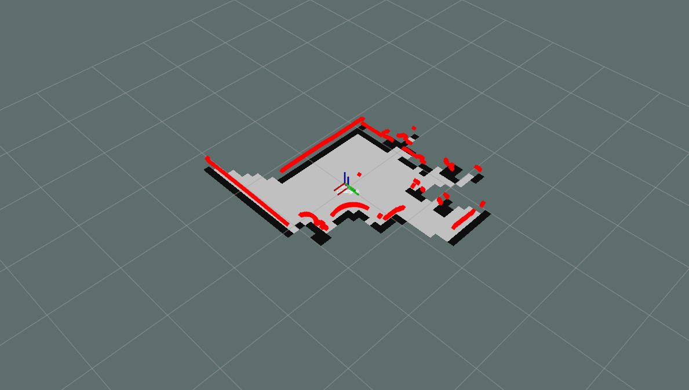
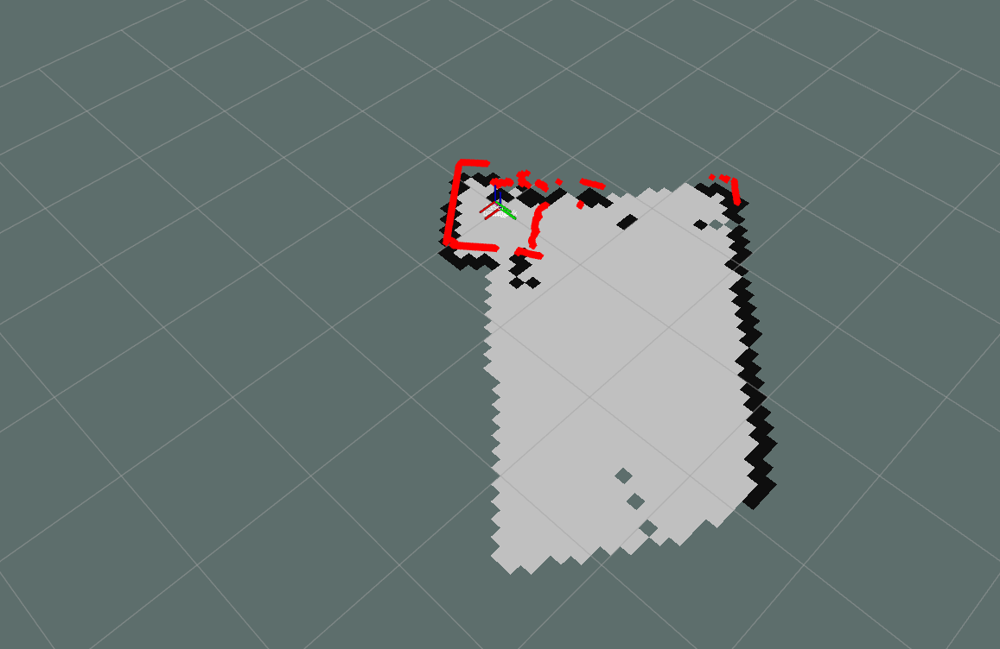
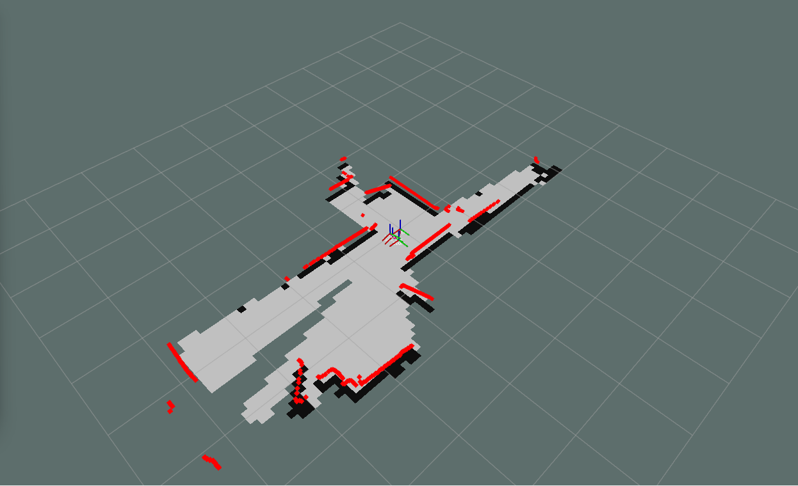
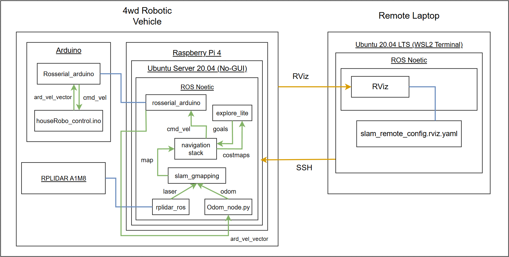

# HouseRobot stage 1: Mini ROS 4wd Robotic Vehicle
In the first stage of the HouseRobot project, I aim to design and build a small ROS-based (Robot Operating System) vehicle capable of mapping and navigating around the house. Subsequent stages will build upon this foundation. Through this stage, I plan to gain further experience with the following technologies:
- ROS
- LiDAR
- SLAM
- Navigation
- Frontier Exploration
- Ubuntu for embedded devices

<p align="center">
  
  
  
  
</p>

## Hardware
- Raspberry Pi 4 Computer Model B 2GB RAM
- RPLIDAR A1M8 (connects to Raspberry Pi)
- Arduino UNO R3
- L293D Motor Driver Shield (connects onto Arduino UNO board)
- DFRobot 4WD Mobile Platform for Arduino
- Power bank with 5V/3A power supply (powers Raspberry Pi device)

## Software Requirements
### Remote Laptop
- Ubuntu 20.04 LTS WSL2 (Remote Laptop)
- ROS Noetic
- ROS Noetic packages:
  - Rviz
  - rosserial: https://github.com/ros-drivers/rosserial/tree/noetic-devel
- Arduino IDE:
  - If you want to edit the [houseRobo_control.ino](Arduino/houseRobo_control/houseRobo_control.ino) file
  - rosserial_arduino: generated and copied over from Ubuntu ROS Noetic setup (More details in [Project Setup](#project-setup) section)

### 4wd Robotic Vehicle
- Ubuntu Server 20.04 (Robot vehicle)
  - GUI components removed to save memory capacity
- ROS Noetic
- ROS Noetic Packages:
  - rplidar_ros: https://github.com/robopeak/rplidar_ros/tree/master
  - slam_gmapping: https://github.com/ros-perception/slam_gmapping/tree/melodic-devel
  - openslam_gmapping: https://github.com/ros-perception/openslam_gmapping/tree/melodic-devel
  - explore_lite: https://github.com/hrnr/m-explore/tree/noetic-devel
  - rosserial: https://github.com/ros-drivers/rosserial/tree/noetic-devel
  - navigation stack: sudo apt install ros-noetic-navigation

## High-level View of Project Components


## Project Setup
### Remote Laptop
1. Install Arduino IDE for the laptop.
2. Install ROS Noetic on the Ubuntu laptop or terminal.
3. Install the ROS Noetic packages listed in [Software Requirements](#software-requirements) section.
4. Copy the [slam_remote_config.rviz.yaml](remote_laptop_files/slam_remote_config.rviz.yaml) file into your Ubuntu environment.

#### Generate rosserial libraries for Arduino IDE (optional)
If you want to edit and compile the rosserial arduino file.

1. Source your ROS Noetic workspace setup.
2. Generate rosserial libraries for arduino: The cmd will generate a ros_lib folder.
```bash
rosrun rosserial_arduino make_libraries.py
```  
3. Copy the ros_lib folder to the Arduino/libraries folder for your Arduino IDE.

### 4wd Robotic Vehicle
#### Software setup
1. Flash the houseRobo_control.ino image onto the Arduino Uno.
2. Use the Raspberry Pi Image application to flash an Ubuntu Image onto an SD card for the Raspberry Pi device.
3. Setup the Ubuntu OS for the Raspberry Pi (requires a keyboard and monitor for the Raspberry Pi device).
4. Configure the netplan for the Ubuntu system to have a static IP address (we will reference to this as the robot_ip).
5. Once Ubuntu is setup for the Raspberry Pi device, you can SSH into the device from your laptop remotely to complete the rest of the setup.
6. Install ROS Noetic on the Ubuntu system.
7. Source the ROS Noetic setup.
8. Clone this Github repo.
9. Install all the listed ROS Noetic Packages for 4wd Robotic Vehicle in the houseRobo_ros1_ws/src folder.
  - Navigation stack will be installed for the ROS Noetic setup using *sudo apt*.
  - Clone all the other listed repositories into the folder.
10. Build all the packages by running the following command in the houseRobo_ros1_ws folder:
```bash
catkin_make
```
#### Physical setup
1. Build robot and assemble the components together.
2. Connect the L293D Motor Driver Shield onto the Arduino UNO board.
3. Connect the motors to the L293D Motor Driver Shield.
4. Connect Arduino UNO board to the Raspberry Pi using the Arduino's USB progamming cable.
5. Connect the RPLIDAR A1 to the Raspberry Pi using a USB Micro-B to Type-A cable.
6. Power up the Arduino UNO and Raspberry Pi boards.

## Run Project
### 4wd Robotic Vehicle
1. Source the ROS Noetic environment setup.
2. Set the robot as the RViz server: Replace \<robot_ip\> with the actual static IP address of your robot.
```bash
export ROS_MASTER_URI=http://<robot_ip>:11311
export ROS_HOSTNAME=<robot_ip>
```
3. Source the ROS project workspace setup.
4. Start roscore.
```bash
roscore
```
5. Open a new terminal window (tmux is convenient to use).
  - The houseRobo_package will be launched in this window, but it needs the same setup.
6. Source the ROS Noetic environment setup once again in the new window.
7. Set the robot as the RViz server using the same commands.
8. Source the ROS project workspace setup.
9. Launch the houseRobo_package node:
```bash
roslaunch houseRobo_package robot_bringup.launch
```

### Remote Laptop
1. Source the ROS Noetic setup.
2. Set it as the RViz client: Replace \<robot_ip\> and \<laptop_ip\> for the actual IP addresses of your devices.
```bash
export ROS_MASTER_URI=http://<robot_ip>:11311
export ROS_HOSTNAME=<laptop_ip>
```
3. Run RViz with the config file: Replace *path/to/* with the actual path to the file.
```bash
rviz -d path/to/slam_remote_config.rviz.yaml
```  
  
Now you should see the map and LiDAR scans sent from the robot on the remote laptop.

## Additional Files In Repo
### Arduino folder
- Measure_for_ros.ino
  - Needed to measure the motor power to velocity mappings for following ROS cmd_vel messages.
  - There was no more available pins on the Arduino to connect another button due to the L293D motor driver shield connection.
  - Used the reset button of the Arduino to cycle through 5 power levels, taking 3 measurements at each power level. First cycle is for linear velocity measurements, followed by angular velocity measurements in the second cycle.
  - Used the EEPROM memory keep track of the stages of the experiment.
  - Used MAGIC_VALUE stored at a MAGIC_ADDR in EEPROM to determine when a new sketch was programmed and reset the values of the trackers in EEPROM. State of EEPROM memory is indeterminate unless initialized.
  - After programming, unplugging the Arduino from the laptop, and powering up the Arduino once again, the Arduino performs two resets during this process. Therefore, there is an extra tracker to start the experiment only on the third reset.

### HouseRobo_package/src
- shutdown_listner.py
  - The node would spin up when the ROS nodes are launched with the robot_bringup.launch file.
  - The node would listen for a "shutdown" message sent from the remote laptop and then run the shell script "save_and_shutdown.sh"

### robot_ubuntu_files
- ros_robot_startup.sh
  - Used to experiment auto start up of Robot once it powers up or recieves a command from remote laptop.
  - Feature is incomplete at the moment.
- save_and_shutdown.sh
  - Robot does not follow the save and shutdown sequence and needs further debugging.

## Additional Project Notes
- If get rplidar_ros node service time out when launching houseRobo_package, just reconnect the Rplidar to the Raspberry Pi (pull out the usb and plug in again).

## Limitations and Future Work
### Further Extensions of Stage 1:
- No real odom data used
  - There were no more available pins on the Arduino to connect a wheel encoder after connecting the L293D Motor Driver shield board.
  - The Arduino Uno board only has 2KiB of SRAM and it was not enough to accomodate another ROS node for publishing odom data. Therefore, I had to implement a separate ROS node that runs on the Raspberry Pi for publishing the odom data.
  - I created a ROS cpp node (odom_node.cpp) to calculate and publish theoretical odom values based on the cmd_vel commands executed by the Arduino node.
  - The odom values are very innaccurate as it does not account for the cumulative errors introduced during the control of the robot.
  - Need to choose a different board that will have enough pins to atleast control the 4 TT motors and connect a wheel encoder for odom values. Planning to explore the Teensy 4.1 board.
- Fix and complete the remote startup and remote terminate features of the robot.
- Unbalanced load on the two sides of the wheels during robot manoeuvres.
  - Currently, only positive linear velocity and angular velocity commands are used. Which means that the robot can only drive forward or turn left.
  - The robot is only using the right side wheels to turn left which places an additional load on the right side wheels.
  - The controls can be modified to use both side wheels equally for all manouevres. E.g. During a left turn, the left side wheels can reverse while the right side wheels drive forwards, distributing the loads evenly between the wheels.
  - Better manufacturing and modeling methods for the mini-ros robot, to balance the weight distribution across the wheels.
  - Better models of the robot will lead to more accurate conversions cmd_vel commands and the power needed to drive the motors.
- Use ROS2, as ROS1 has reached end-of-life and ROS2 provides for more security and reliability with commercial use in mind.
- Insufficient computational resource of the Raspberry Pi for handling more precise LiDAR maps (e.g. 1 cm grid size resolutions) and the premature termination of the exploration algorithm
  - The Raspberry Pi board that I am using does not have enough memory for more precise LiDAR maps and I had to use grid size resolutions of size 10 cm.
  - The result is that the Exploration algorithm does not identify all the frontiers and prematurely terminates the exploration as it sees there are no frontiers left to explore.
- Currently I have three different power sources attached to the robot. One for the 4 TT motors, one for the Arduino board, and a final one for the Raspberry Pi board.
  - I believe it should be possible to reduce it to one power source for powering the 3 different components of the robot.
- It will be interesting to create a full model of the robot and simulate it in Gazebo.

### Stage 2 Plans:
- In stage 2, I aim to explore the following technologies:
  - Omni-directional controls
  - Nvidia Jetson Nano Developer Kit
  - RGB-D Cameras
  - State-of-the-art navigation algorithms
  - Deep Learning Robotic perception and navigation algorithms